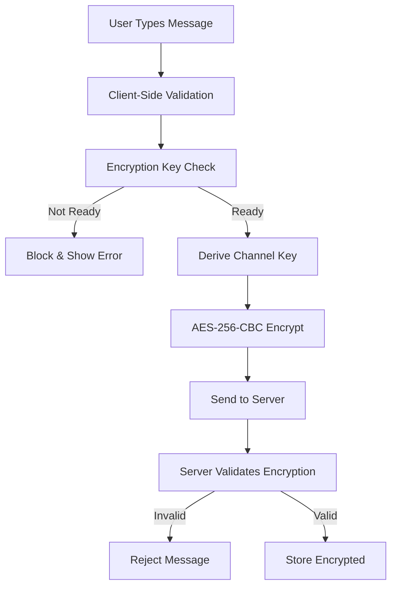

# Nexus End-to-End Encryption Architecture

## Overview

Nexus implements **mandatory end-to-end encryption** for all communications. This document outlines the comprehensive security architecture that ensures all messages, direct communications, and sensitive data are encrypted by default.

## Core Security Principles

### 1. Zero-Knowledge Architecture
- **Server Never Sees Plaintext**: All message content is encrypted on the client before transmission
- **Encryption Keys Stay Local**: Master keys are derived and stored locally, never transmitted
- **No Backdoors**: Even system administrators cannot decrypt user messages

### 2. Mandatory Encryption Policy
- **No Optional Encryption**: All messages must be encrypted - system blocks unencrypted content
- **Fail-Safe Security**: Login fails if encryption cannot be initialized
- **Client-Side Validation**: Multiple layers prevent unencrypted data transmission

### 3. Defense in Depth
- **Client-Side Password Hashing**: Passwords are SHA-256 hashed before transmission
- **Server-Side Bcrypt**: Pre-hashed passwords are bcrypted again on server
- **Transport Security**: HTTPS/WSS for all communications
- **Input Validation**: Comprehensive sanitization and validation

## Encryption Implementation

### Message Encryption Flow



### Key Management

#### Master Key Derivation
```javascript
// PBKDF2 with 100,000 iterations
masterKey = PBKDF2(userPassword, userId, 100000, 256bits)
```

#### Channel-Specific Keys
```javascript
// Unique key per channel
channelKey = PBKDF2(masterKey, channelId, 10000, 256bits)
```

#### Direct Message Keys
```javascript
// Deterministic key for user pairs
dmKey = PBKDF2(masterKey, sortedUserIds.join('-'), 10000, 256bits)
```

### Database Schema

#### Messages Table
```sql
CREATE TABLE messages (
    id SERIAL PRIMARY KEY,
    content TEXT NOT NULL, -- Always '[ENCRYPTED]' placeholder
    encrypted_content TEXT NOT NULL, -- Actual encrypted content
    is_encrypted BOOLEAN DEFAULT TRUE NOT NULL,
    encryption_version VARCHAR(10) NOT NULL,
    -- ... other fields
);
```

#### Security Constraints
```sql
-- Prevent unencrypted messages
ALTER TABLE messages ADD CONSTRAINT messages_must_be_encrypted 
CHECK (is_encrypted = TRUE AND encrypted_content IS NOT NULL);
```

## Security Features

### Client-Side Protection
- **Mandatory Encryption Check**: All message operations validate encryption state
- **Key Validation**: Robust checks ensure encryption keys are properly initialized
- **Secure Password Handling**: Passwords never stored in memory longer than necessary
- **Session Protection**: Encrypted master keys stored with user password protection

### Server-Side Protection
- **Encryption Validation**: Server rejects any unencrypted message attempts
- **Content Verification**: Validates that message content is encryption placeholder
- **Field Requirements**: All encryption fields (content, version, flags) must be present
- **Security Headers**: CORS, CSP, and other protective headers

### Transport Security
- **HTTPS Everywhere**: All HTTP communications use TLS 1.3
- **WebSocket Security**: WSS (WebSocket Secure) for real-time communications
- **Certificate Pinning**: Production deployments use certificate pinning
- **HSTS Headers**: Strict Transport Security prevents downgrade attacks

## Password Security

### Client-Side Hashing
```typescript
// Pre-hash passwords before transmission
const transmissionHash = SHA256(salt + password + 'nexus_client_salt_v1');
```

### Server-Side Storage
```javascript
// Double-hash the client hash
const serverHash = await bcrypt.hash(clientHash, 12);
```

### Benefits
1. **No Plaintext Transmission**: Passwords never sent in clear text
2. **Double Protection**: Even if transmission is intercepted, password is hashed
3. **Server Compromise Mitigation**: Server breach doesn't expose plaintext passwords
4. **Rainbow Table Protection**: Salted hashes prevent rainbow table attacks

## Error Handling & Recovery

### Encryption Failures
- **Login Blocking**: System prevents login if encryption fails
- **Clear Error Messages**: Users understand security requirements
- **Recovery Guidance**: Help users resolve encryption issues
- **Graceful Degradation**: Never falls back to unencrypted mode

### Session Recovery
- **Password Re-entry**: Lost sessions require password to restore encryption
- **Key Validation**: System validates encryption state on load
- **Secure Fallback**: Users must re-authenticate if encryption cannot be restored

## Compliance & Standards

### Cryptographic Standards
- **AES-256-CBC**: Industry-standard symmetric encryption
- **PBKDF2**: Key derivation with high iteration counts
- **SHA-256**: Secure hashing for password pre-processing
- **bcrypt**: Adaptive password hashing with high work factors

### Security Practices
- **Regular Security Audits**: Quarterly security assessments
- **Dependency Scanning**: Automated vulnerability scanning
- **Penetration Testing**: Annual third-party security testing
- **Bug Bounty Program**: Responsible disclosure incentives

## Monitoring & Alerting

### Security Events
- **Encryption Failures**: Monitor and alert on encryption initialization failures
- **Unencrypted Attempts**: Log and block any unencrypted message attempts
- **Key Rotation**: Track and manage encryption key lifecycle
- **Authentication Anomalies**: Monitor unusual authentication patterns

### Performance Metrics
- **Encryption Latency**: Monitor encryption/decryption performance
- **Key Derivation Time**: Track key generation performance
- **Message Throughput**: Ensure encryption doesn't impact user experience
- **Error Rates**: Monitor encryption-related error frequencies

## Future Enhancements

### Planned Features
- **Perfect Forward Secrecy**: Automatic key rotation for enhanced security
- **Hardware Security Keys**: Support for FIDO2/WebAuthn
- **Cross-Device Sync**: Secure key synchronization across devices
- **Message Integrity**: HMAC verification for message authenticity
- **Advanced Threat Detection**: ML-based security anomaly detection

### Research Areas
- **Post-Quantum Cryptography**: Preparation for quantum-resistant algorithms
- **Homomorphic Encryption**: Enable server-side processing of encrypted data
- **Secure Multiparty Computation**: Advanced privacy-preserving features
- **Zero-Knowledge Proofs**: Enhanced privacy and authentication

## Conclusion

Nexus's mandatory end-to-end encryption architecture ensures that user privacy and security are never compromised. By making encryption a core requirement rather than an optional feature, we provide users with unparalleled protection for their communications while maintaining excellent user experience and performance.

The system's defense-in-depth approach, combined with rigorous validation and monitoring, creates a robust security foundation that protects against both external threats and potential insider risks. Users can communicate with complete confidence that their conversations remain private and secure.